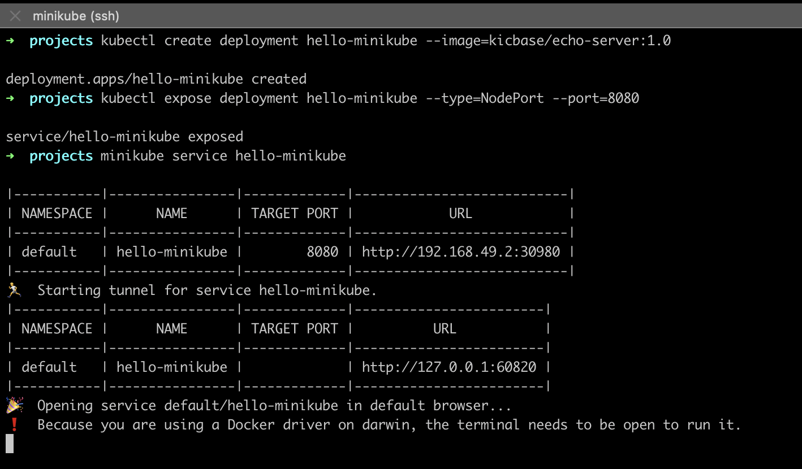

# Comparison and overview of exiting solutions for local Kubernetes cluster

## minikube

> minikube is local Kubernetes, focusing on making it easy to learn and develop for Kubernetes. 
> All you need is Docker (or similarly compatible) container or a Virtual Machine environment, and Kubernetes is a single command away:  `minikube start`

#### Main features
-   Supported OS: Linux, macOS, Windows (x86-64)
-   Supported Architectures: x86-64, arm
-   Automation: Limited automation capabilities
-   Additional Features: Add-ons for cluster services and features
-   Ease of Use: Easy to set up and get started
-   Cluster Monitoring: Requires additional tools (e.g., Prometheus, Grafana)
-   Interaction with Cluster: Full interaction with the cluster
-   Documentation: Well-documented with official documentation available

#### Pros/Cons
-   **Advantages**: Easy to use, fast deployment, stable operation, good documentation and community support. *Moderate configuration effort required to use Podman.*
-   **Disadvantages**: Limited automation capabilities, limited scalability, requires additional tools for cluster monitoring.

#### Conclusion
- `minikube` is a lightweight and easy-to-use tool for local development and testing of Kubernetes applications. It provides good support for various operating systems and architectures.
 - `minikube` is a suitable choice for the startup's PoC if they prioritize simplicity and ease of use. It is well-documented and has a strong community support.

## kind
**K**ubernetes **IN D**ocker, a tool for running local Kubernetes clusters inside Docker containers. It allows to create multi-node Kubernetes clusters on your local system.
#### Main features
-   Supported OS: Linux, macOS, Windows (x86-64)
-   Supported Architectures: x86-64
-   Automation: Limited automation capabilities
-   Additional Features: None built-in, but can use standard Kubernetes tools
-   Ease of Use: Relatively easy to set up and use
-   Cluster Monitoring: Requires additional tools (e.g., Prometheus, Grafana)
-   Interaction with Cluster: Full interaction with the cluster
-   Documentation: Good documentation available, but not as extensive as minikube

#### Pros/Cons
-   **Advantages**: Easy to use, fast deployment, stable operation, good documentation and community support.
-   **Disadvantages**: Limited automation capabilities, limited scalability, limited set of additional features. *Challenging setup to configure Podman.*

#### Conclusion    
- `kind` offers the ability to create local Kubernetes clusters using Docker containers. It provides a convenient and lightweight way to test and validate Kubernetes deployments.
- `kind` is recommended for the startup's PoC if they want to leverage the benefits of Docker containers for local development and testing. It is relatively easy to set up and provides good compatibility with Kubernetes.

## k3d
Lightweight tool for creating and running Kubernetes clusters in Docker containers. It leverages Rancher Kubernetes Engine (RKE) to quickly spin up and test Kubernetes clusters locally.

#### Main features
-   Supported OS: Linux, macOS, Windows (x86-64)
-   Supported Architectures: x86-64
-   Automation: Limited automation capabilities
-   Additional Features: None built-in, but can use standard Kubernetes tools
-   Ease of Use: Easy to set up and use
-   Cluster Monitoring: Requires additional tools (e.g., Prometheus, Grafana)
-   Interaction with Cluster: Full interaction with the cluster
-   Documentation: Limited official documentation, but good community support

#### Pros/Cons
-   **Advantages**: Easy to use, fast deployment, stable operation, good community documentation.
-   **Disadvantages**: Limited automation capabilities, limited set of additional features, limited official documentation. *Relatively complex configuration process for Podman integration.*

#### Conclusion
- `k3d` enables quick creation and testing of Kubernetes clusters in Docker containers using Rancher Kubernetes Engine (RKE). It offers a streamlined experience for local development and experimentation.
- For the startup's PoC, `k3d` is a suitable choice if they require a fast and efficient way to set up Kubernetes clusters in Docker containers. It provides good performance and flexibility.

## Comparison table

|    |minikube        |kind		                 |k3d                          |
|----|----------------|--------------------------|-----------------------------|
|**OS/arch**| - Windows: x86-64  - macOS: x86-64, ARM64  - Linux: ARM64, ARMv7,  ppc64, S390x |- Windows: x86-64  - macOS: x86-64  - Linux: x86-64, ARM64|- Windows: x86-64  - macOS: x86-64  - Linux: x86-64, ARM64
|**Automation**          |Good automation capabilities through CLI and scripting.            |Highly scriptable and automatable with declarative configuration.            |Command-line interface for easy automation.
|**Monitoring tools**          |via additional tools|via additional tools|via additional tools
|**Cluster interaction** |yes|yes|yes
|**Ease of Use**|beginner-friendly|user-friendly|requires familiarity with Docker concepts and configuration
|**Documentation**          |Comprehensive documentation available on the official website, covering installation, usage, troubleshooting, and more.           |Official documentation provides instructions for installation, basic usage, and configuration.|Documentation available on GitHub with guidance on installation, usage, and configuration           |
|**Sustainability**          |Good sustainability due to its popularity, large user community, and active maintenance.            |Promising sustainability with a growing user base and active development.          |Sustainability may depend on adoption and community involvement as a newer tool.
|**Podman**|Moderate difficulty |Challenging configuration |Relatively complex setup.

